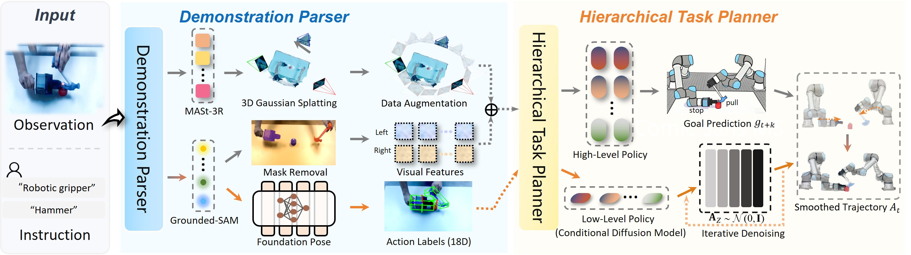

# 🛠 Tool-Action Comprehension

<div align="center">

**A Cross-Morphology Imitation Learning Framework for Bimanual Manipulation**

[](#)
[](LICENSE)
[](https://www.python.org/)
[](https://pytorch.org/)

*Yechen Fan, Xinjie Zhang, Jianghao Zhao, Xiaohan Liu, Haibin Wu, Jinhua Ye, and Gengfeng Zheng*



</div>

## 📖 Overview

**Tool-Action Comprehension** is a novel cross-morphology imitation learning framework designed to bridge the morphology gap between humans and robots.

By focusing on **tool-centric representations**, TAC allows dual-arm robots to master complex, dynamic bimanual tasks (e.g., flipping eggs, pulling out nails, transporting blocks) purely by observing natural human demonstration videos, eliminating the need for costly teleoperation devices or specialized hardware.

<div align="center">
  <video controls autoplay loop muted playsinline width="40%">
    <source src="assets/preprocessed_human_data.mp4" type="video/mp4">
    Your browser does not support the video tag.
  </video>
</div>

## ✨ Key Features

- 🚫 **Teleoperation-Free**: Learns directly from natural human videos using everyday tools. No VR suits, specialized grippers, or complex hardware required.
- 🔄 **Cross-Morphology Alignment**: Employs **Grounded-SAM** for human hand morphological decoupling and **FoundationPose** for 6D tool tracking, creating a robust, embodiment-agnostic observation space.
- 🧠 **Hierarchical Diffusion Policy**: Decomposes complex bimanual tasks into high-level coordinated goal prediction and low-level synchronized trajectory generation for smooth, stable control.
- 🎥 **3D Scene Augmentation**: Leverages **MASt-3R** and **Gaussian Splatting** to reconstruct scenes and generate multi-view training data, significantly enhancing robustness against camera disturbances and spatial perturbations.

---

## ⚙️ Installation

### 1. System Dependencies

Ensure you have the necessary system libraries installed:

```bash
sudo apt update
sudo apt install -y libosmesa6-dev libgl1-mesa-glx libglfw3 patchelf libglm-dev
```

### 2. Clone Repository

```bash
git clone --recursive https://github.com/yechen056/Tool-Action-Comprehension.git
cd Tool-Action-Comprehension/
```

### 3. Setup Python Environment

We recommend using Mamba for faster dependency resolution:

```bash
mamba install mamba=1.5.1 -n base -c conda-forge
mamba env create -f conda_environment.yml
mamba activate tac
```

### 4. Manual Environment Setup (Optional)

<details>
<summary>Manual setup steps</summary>

```bash
conda create -n tac python=3.10.18 -y
conda activate tac

pip install torch==2.0.1 torchvision==0.15.2 --index-url https://download.pytorch.org/whl/cu118
pip install numpy==1.26.4 scipy==1.12.0 numcodecs==0.12.1 pyyaml==6.0.1
pip install -r requirements.txt
```
</details>

### 5. Install Third-Party Dependencies

Build required submodules (Grounded-SAM, FoundationPose, PyTorch3D):

```bash
export AM_I_DOCKER=False
export BUILD_WITH_CUDA=True
export CUDA_HOME=/usr/local/cuda-11.8 # Update according to your CUDA version

# Install GroundingDINO and NVdiffrast
pip install --no-build-isolation -e third_party/Grounded-Segment-Anything/GroundingDINO
pip install --no-build-isolation "git+https://github.com/NVlabs/nvdiffrast.git"

# Build FoundationPose
cd third_party/FoundationPose/mycpp
rm -rf build && mkdir build && cd build
CMAKE_PREFIX_PATH="$(python -m pybind11 --cmakedir)" cmake ..
make -j$(nproc)

cd ../bundlesdf/mycuda
python setup.py build_ext --inplace
export PYTHONPATH=$(pwd):$PYTHONPATH
export LD_LIBRARY_PATH=$CONDA_PREFIX/lib/python3.10/site-packages/torch/lib:$LD_LIBRARY_PATH
cd ../../../

# Build PyTorch3D
cd third_party/pytorch3d
rm -rf build && find . -name "*.so" -delete
TORCH_CUDA_ARCH_LIST=8.9 FORCE_CUDA=1 CUDA_HOME=/usr/local/cuda-11.8 python setup.py install
cd ../..
```

### 6. Download Model Checkpoints

Run the script to download necessary pre-trained weights (e.g., FoundationPose, SAM):

```bash
bash setup_downloads.sh
```

Note: GroundingDINO requires a local BERT model. Generate it via:

```bash
python -c "from transformers import AutoTokenizer, BertModel; AutoTokenizer.from_pretrained('bert-base-uncased').save_pretrained('./third_party/bert-base-uncased'); BertModel.from_pretrained('bert-base-uncased').save_pretrained('./third_party/bert-base-uncased')"
```

## 🚀 Usage

### Step 1: Camera Calibration

Use a ChArUco board (See `tac/ChArUco_Board.pdf`) to calibrate the multi-camera setup.

```bash
python scripts/camera_calibration.py
```

### Step 2: Collect Human Demonstrations

Record human tool-use videos across your camera setup.

```bash
python scripts/collect_human_data.py --output data/your_task_name
```

### Step 3: Preprocess Demonstrations

This automatically performs hand-masking (Grounded-SAM) and 6D pose annotation (FoundationPose).

```bash
python scripts/preprocess_human_data.py --dataset data/your_task_name
```

## ❓ Troubleshooting

<details>
<summary><b>Click to expand common issues and solutions</b></summary>

1. AttributeError: module 'collections' has no attribute 'MutableMapping'

```bash
pip install protobuf==3.20.1
```

2. FoundationPose Build Failures (Eigen missing)

```bash
CONDA_ENV_PATH=$(conda info --base)/envs/$(basename "$CONDA_PREFIX")
EIGEN_PATH="$CONDA_ENV_PATH/include/eigen3"
export CMAKE_PREFIX_PATH="$CMAKE_PREFIX_PATH:$EIGEN_PATH"
```

3. CUDA Version Mismatch
Ensure your `CUDA_HOME` matches your `nvcc --version`:

```bash
export CUDA_HOME=/usr/local/cuda-11.8
```

4. RealSense Camera Not Detected

```bash
rs-enumerate-devices
sudo usermod -aG plugdev $USER # Requires re-login
```

</details>

## 📜 License

This project is released under the [MIT License](LICENSE).
